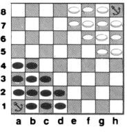
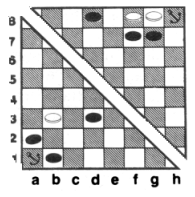

# Архимед

## ОБОРУДОВАНИЕ

В «Архимед» можно играть стандартным набором шашек. 
Доска представляет собой сетку 8x8,
и у каждого игрока есть 12 «кораблей», 
представленных шашками одного цвета.

## РАССТАНОВКА

Портом приписки каждого игрока является 
ближайший левый угловой квадрат. 
Корабли начинают игру вокруг портов,
как показано на начальной расстановке 
ниже. 



Игроки ходят по очереди. 
Каждый ход состоит из двух частей:
перемещение и (по возможности) 
уничтожение кораблей.

## ПЕРЕМЕЩЕНИЕ

Каждый игрок перемещает один корабль за ход. 
Корабль перемещается на любое количество 
пустых клеток по прямой линии, по вертикали, 
горизонтали или диагонали 
(то есть, как шахматная королева). 
Однако корабль никогда не может закончить ход 
в порту приписки.

## УНИЧТОЖЕНИЕ КОРАБЛЕЙ

Два корабля противника «атакуют» друг друга, 
если они стоят лицом друг к другу по прямой линии,
и между ними нет других кораблей 
(чтобы каждый мог переместиться 
на клетку другого).

Корабль, атакованный тремя или более вражескими кораблями, 
считается «уязвимым». 
В конце хода вы должны уничтожить все уязвимые вражеские корабли, 
убрав их с доски.

В примере ниже белый корабль на ```b3``` 
атакуют чёрные корабли на ```a2```, ```b1``` и ```d3```, 
и его можно уничтожить.




Вы можете уничтожить вражеские корабли 
только после своего хода. 
Иногда, 
если вражеский корабль был уязвим 
в начале вашего хода, 
ваш ход в этом ходу сделает 
его неуязвимым. 
В этом случае вы не можете 
уничтожить корабль.

Если уничтожение одного корабля 
делает уязвимым другой корабль, 
который ранее не был уязвимым, 
оба корабля должны быть уничтожены. 
В примере ниже уничтожение белого корабля 
на ```f8``` делает уязвимым корабль 
на ```g8```. 
Оба корабля уничтожаются.

## ВОССТАНОВЛЕНИЕ КОРАБЛЕЙ

В ​​начале своего хода вы можете восстановить 
один из своих уничтоженных кораблей. 
Корабль размещается в вашем домашнем порту, 
и поскольку корабли не могут заканчивать ход 
в своём порту, 
вы должны использовать свой ход, 
чтобы переместить корабль 
из порта. 
Следовательно, 
вы не можете перестроить корабль, 
пока у вас не появится свободная клетка 
для перемещения корабля.

## ПОБЕДА

Вы выигрываете игру, 
переместив один из своих кораблей 
во вражеский порт, 
при условии, 
что ваш противник не сможет уничтожить 
его в свой следующий ход. 
(Если противник сможет уничтожить его, 
игра продолжается.)
