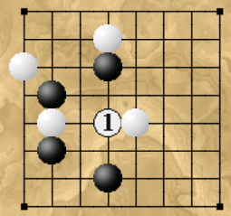
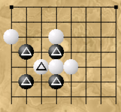

# Attract (Притяжение)

«Притяжение» — простая игра, 
в которой фигуры размещаются на изначально пустой доске 
и притягивают окружающие их фигуры. 

Выигрывают группы фигур, 
выстроившиеся в определённом порядке. 
Если в какой-то момент у одного игрока 
окажется больше выигрышных построений, 
чем у его противника, 
он побеждает!

## ХОДЫ 

На каждом ходу каждый игрок должен выполнить 
следующие действия:
+ Сначала положить свой камень на пустую клетку
+ Затем все фишки в одном горизонтальном и вертикальном рядах 
должны переместиться на одну клетку ближе к поставленной фишке, 
если это возможно.

## ЦЕЛЬ 

Если в конце хода на каждой соседней по диагонали клетке 
есть фишки противника (всего 4), 
то побеждает игрок,
у которого больше таких фишек. 
Если эти числа равны, 
игра продолжается.

## Пример хода белых.

Белые играют в [1], 
привлекая четыре разных камня 
(см. следующую диаграмму), 

и, сделав это, выигрывают, 
создавая одну выигрышную комбинацию
(отмеченные камни), 

в то время как у чёрных 
таких камней нет.

