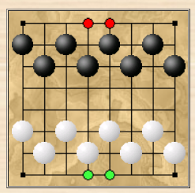
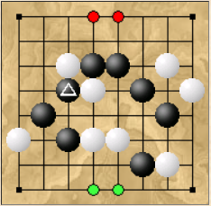

# Баскетбол

## ПОДГОТОВКА

Игрок размещает свои 8 фишек 
на стартовых позициях.



## ЦЕЛЬ. 

## КЛЕТКИ ВОРОТА 

Две средние клетки в последнем ряду игрока.

## ХОДЫ 

На каждом ходу каждый игрок должен переместить 
один из своих камней одним 
из следующих способов:

+ На первых четырёх рядах (сторона игрока) камень 
может скользить перпендикулярно к пустым клеткам 
на любое количество клеток 
(таким образом, прыжков нет). 
Однако камень не может переместиться 
на сторону противника.

+ На всей доске камень может перепрыгнуть 
через соседний 
(ортогональный или диагональный) 
свой камень к ближайшей 
пустой клетке. 
Прыжков может быть несколько, 
но они не обязательны.

+ В любом из ходов камни не могут пересекать 
или останавливаться на своих 
клетках ворот.

## ГОЛ 

Выигрывает игрок, 
который переместит один из своих камней 
в одну из клеток ворот.

Этот набор правил допускает 
простую ничейную стратегию, 
например, 
белые могут сравнять счёт, 
разместив камни на клетках
 ```c1```, ```c2```, ```d2```,
 ```e3```, ```f2```, ```f1```, 
оставив два других камня 
для перемещения. 
Возможным решением было бы разрешить 
прыжки через фигуры противника, 
находящиеся рядом с ячейками 
ворот игрока.

## Пример



Ход чёрных. 
Чёрные могут выиграть, 
выполнив следующую последовательность прыжков 
(используя отмеченный камень):  
```c5-e7-e5-g5-g3-e1```.

КОММЕНТАРИИ

Нет ловли фигуры (в отличие от шахмат или шашек).

Ни при каких обстоятельствах нельзя перепрыгивать 
через одну фигуру противника.

За один ход нельзя совмещать 
ход по отдельности 
и прыжок.

Запрещается пересекать или останавливаться 
в пределах своих ворот.
