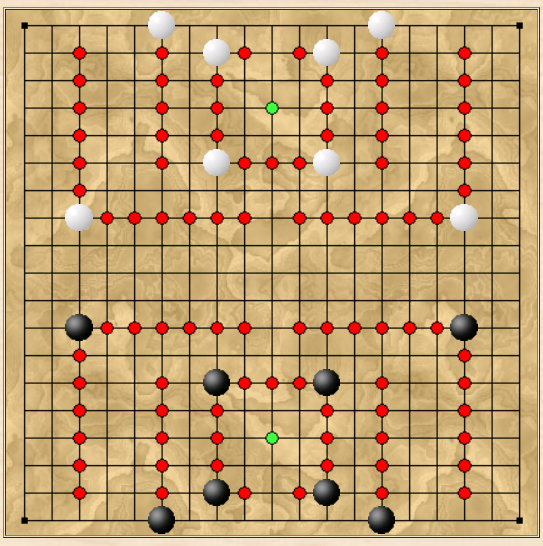

# CASTLE

## СТЕНЫ И ЗАМОК 

Красные точки обозначают стены. 
Зелёные точки обозначают трон. 
Все остальные клетки — земля.

Исходя из расстановки, предполается, 
что все камни находятся 
на клетках стены.

## ХОД

На каждом ходу каждый игрок 
перемещает свой камень.

Камень может скользить перпендикулярно 
к любому количеству пустых клеток.

Скольжение возможно только 
по земле или стене. 
Скольжение не может пересекать 
оба типа клеток.

Камень не может скользить по своему трону 
или перемещаться на него.

Камень может перемещаться на клетку другого типа 
(со стены на землю или наоборот), 
если эта клетка перпендикулярна 
соседней.

Возможен захват путём замены 
(захват не обязателен).

## ЦЕЛЬ

Игрок выигрывает, 
если поместит один камень 
на трон противника.

