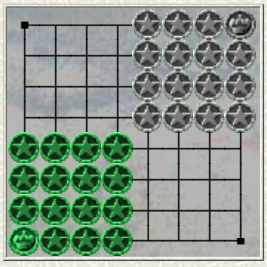
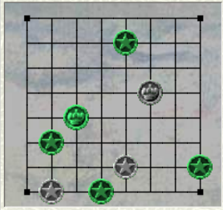

# EUCLID

## ХОД 

За каждый ход каждый игрок перемещает 
одну из своих фигур.

## КОРОЛЬ 

Король перемещается как шахматный ферзь, 
сдвигаясь на любое количество клеток 
в любом ортогональном или 
диагональном направлении.

Король не может брать 
и быть захваченным.

## СОЛДАТ 

Солдат перемещается как шахматная ладья, 
сдвигаясь на любое количество клеток 
в любом ортогональном 
направлении.

Завершая ход, 
он захватывает любого вражеского солдата 
на пересечении ортогональных линий, 
проходящих через него 
и через своего короля.
 
Представьте себе прямоугольник, 
образованный на доске солдатом 
и королем. 
Захваченные фигуры находятся 
в двух других углах 
прямоугольника. 
Поэтому он может захватить 
две фигуры сразу.

## ЦЕЛЬ

Игрок, у которого две или меньше фигур, 
проигрывает.

## Пример

Белые ходят и выигрывают за 4 хода:  
b3-b2!  
Затем f5-c2, c4-e4, e2-d2, e4-e1, d2-f2, 
заманивая солдата b1 в ловушку 
и выигрывая следующим 
ходом!

