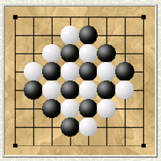
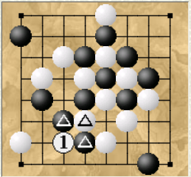

# FISSION

## ХОД



За каждый ход каждый игрок перемещает 
(ортогонально или по диагонали)
камень, 
пока он не ударится о другой камень 
или стену.

Если камень останавливает движение, 
движущийся камень и все соседние камни 
(любого цвета) 
удаляются.

## ЦЕЛЬ 

Игрок, 
у которого нет камней на доске, 
проигрывает.

Игра заканчивается вничью, 
если  
(i) доска становится пустой, или  
(ii) у каждого игрока остается только один камень, или  
(iii) у ходящего игрока нет допустимых ходов.  

## Пример



Это типичная позиция после двух ходов. 

Если белый камень на ```a2``` переместится на клетку [1], 
он будет снят вместе со всеми отмеченными 
камнями.

Если ```f3``` переместится на клетку ```h1```, 
ни одна фигура не будет снята, 
поскольку движущийся камень 
остановился из-за стены.


