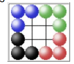
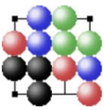

# ITHAKA

Игра проходит на следующей доске:



## КАМНИ 

Все камни нейтральны и могут быть перемещены 
любым игроком.

Фигуру можно передвинуть на любое количество 
пустых клеток по прямой 
(ортогональной или 
диагональной).

Игрок не может передвинуть фигуру, 
которая последней была перемещена противником 
ИЛИ 
которая не находится рядом 
с фигурой его цвета.

## ЦЕЛЬ 

Цель состоит в том, 
чтобы сформировать непосредственно 
смежную ортогональную или диагональную линию 
из трёх фигур одного цвета или 
поставить противника 
в пат.

Игра проиграна при трехкратном 
повторении хода.

## Пример



Последним ходом был синий камень 
на ```b4```. 
У следующего игрока не так много 
вариантов. 
Красный на ```a3``` и синий на ```d2``` 
не могут ходить.

Если синий ```b3-a4```, 
то ```c4-b3``` и выигрыш с помощью 
линии зелёных камней. 
Если красный ```c2-c1```, 
то выиграть с помощью зелёного 
```d3-c2```. 
Два возможных хода:  
чёрный ```b2-a1``` или 
зелёный ```c4-d4```.


